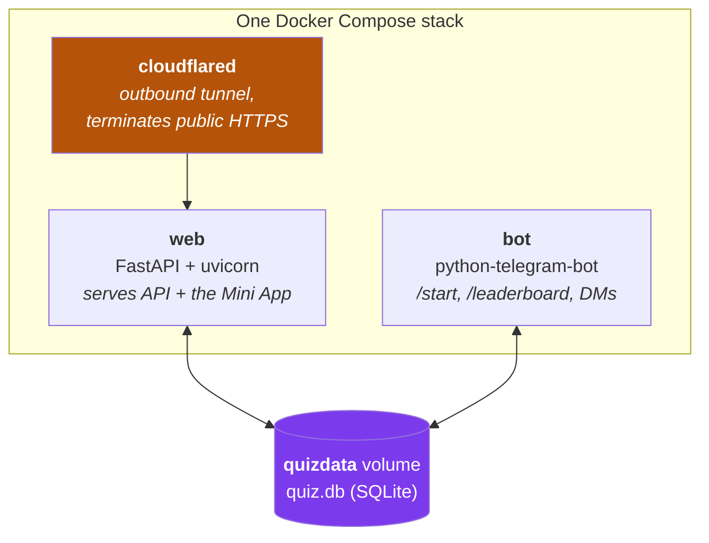
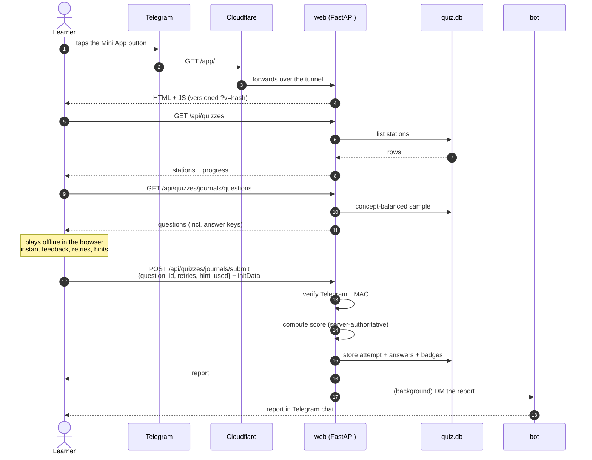
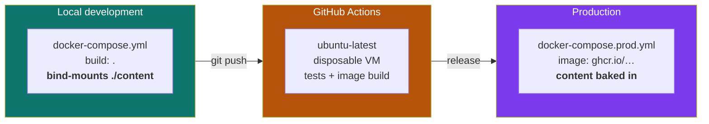

# 1 — The big picture

← [Handbook index](README.md) · Next: [Local development](02-local-development.md)

---

## What this software actually is

A **Telegram Mini App**: a web page that opens *inside* Telegram, which hands it a signed identity
token so the app knows who is playing without any login screen.

It teaches research methodology by **application, not recall** — every task shows an artifact
(a journal solicitation, a paper abstract, a submission screen) and asks for a decision.

## The three processes



All three run from **the same image**. They differ only in the command they run — `web` runs
uvicorn, `bot` runs `python -m app.bot`. One artifact, two roles.

**Why they share a database file rather than talk over HTTP:** the bot needs to post leaderboards
and DM reports. Going through the API would mean authenticating the bot to its own backend for no
benefit. Both are trusted processes on one host, so they open the same SQLite file. SQLite handles
concurrent readers and serialises writers itself.

## What happens when someone plays



**The key subtlety is step 8–9.** The client receives answer keys and checks answers locally so
feedback is instant with no round-trip. On submit it sends only *how* you answered
(`retries`, `hint_used`) — never a score. **The server computes the score.** A crafted request
could lie about retries, so scores are not tamper-proof; see
[Ch. 4](04-content-and-scoring.md#the-tamper-proofing-trade-off) for why that's accepted.

## Where the code lives

```
backend/app/           1 841 lines of Python, no ORM
├── main.py            app assembly, static mounts, cache-busting
├── api.py     (383)   every HTTP route
├── models.py  (234)   SQL queries
├── db.py      (129)   schema + connection
├── migrate.py (175)   idempotent schema upgrades
├── seed.py    (175)   content JSON → database
├── progress.py(123)   concept mastery
├── content_schema.py  validates a quiz document
├── badges.py          10 badge rules
├── scoring.py         retry/hint-aware points
├── sampling.py        concept-balanced question choice
├── auth.py            Telegram initData HMAC
├── report.py          in-app issue reports
├── notify.py          DM via BackgroundTasks
├── config.py          settings from env
└── bot.py             Telegram bot

frontend/              dependency-free vanilla JS
├── index.html         the single page
├── app.js             screens, runner, all interactions
├── game.js            world lerp, embers, level path
├── sprites.js         inline SVG + champion art
├── ui.js              shared UI helpers
├── store.js           local state
├── card.js            Canvas share cards
└── styles.css         the whole Arcane look

content/questions/*.json   7 quizzes, 60 application tasks
```

**Why no framework on the frontend?** It runs inside Telegram's webview on phones with unreliable
networks. Every kilobyte is latency. The app has one page and a handful of screens; a framework
would add weight without removing complexity. `show(name)` swapping `.hidden` classes is enough.

**Why no ORM on the backend?** The schema is ten tables and the queries are simple. An ORM would
add a dependency, a migration tool, and a layer of indirection over SQL that is already readable.
Standard-library `sqlite3` has zero install cost and no version drift.

## The three environments



The one meaningful difference: **locally content is mounted so edits appear instantly; in
production it is inside the image so a content change is a version.** That asymmetry is
deliberate — [decision D-07](10-decision-log.md#d-07-bake-content-into-the-image).

---

Next: [Local development](02-local-development.md) — get it running on your machine.
