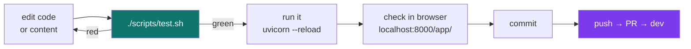
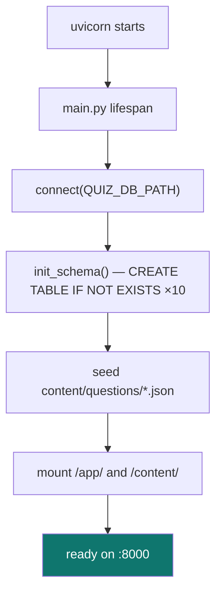
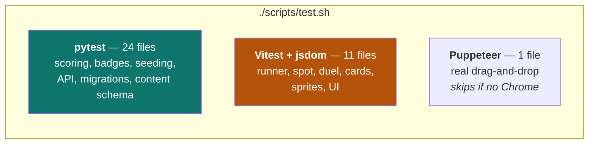
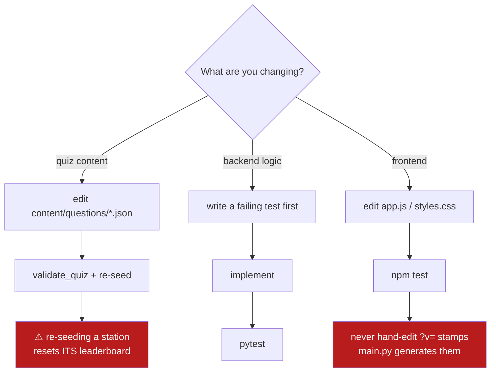

# 2 — Local development

← [Big picture](01-big-picture.md) · [Index](README.md) · Next: [The application](03-the-application.md)

---

## The loop you will actually use



## Prerequisites

| Tool | Why | Check |
|---|---|---|
| Python **3.12+** | `requires-python = ">=3.12"` | `python3 --version` |
| Node **20+** | Vitest test runner | `node --version` |
| Docker + Compose | only for container-based runs | `docker compose version` |
| Chrome/Chromium | *optional* — the one browser e2e test skips without it | |

## Setup, once

```bash
git clone https://github.com/mulhamfetna/boundless-src-researcher-journey-game.git
cd boundless-src-researcher-journey-game

pip install -e './backend[dev]'    # fastapi, uvicorn, PTB + pytest, httpx
cd frontend && npm install && cd ..
```

`-e` installs the backend **editable**: the package points at your working tree, so edits take
effect without reinstalling.

## Running it

```bash
cd backend
QUIZ_DB_PATH=../quiz.db uvicorn app.main:app --reload --port 8000
```

Open **http://localhost:8000/app/**



> **Expect a 401 when you submit.** Outside Telegram there is no `initData`, so the HMAC check in
> `auth.py` rejects the submission. **This is correct behaviour, not a bug.** You can browse, play,
> and see feedback; only recording an attempt requires a real Telegram identity.

### Two databases, don't confuse them

| Path | What it is |
|---|---|
| `./quiz.db` (repo root) | your local scratch DB — **gitignored** |
| `quizdata` volume | the real one, in containers |

⚠️ A stale local `quiz.db` from an older schema causes confusing errors. If something looks
impossible, `rm quiz.db` and restart — it re-seeds from scratch in a second.

## Testing

```bash
./scripts/test.sh          # everything: 141 backend + 54 frontend + browser e2e
cd backend && pytest -q    # backend only
cd frontend && npm test    # frontend only

# one test while debugging
cd backend && pytest tests/test_scoring.py::test_first_try_full_points -v
```



**Why jsdom for the frontend?** The app has no build step and no modules — `app.js` defines globals.
The tests load the real `index.html` body and evaluate the real `app.js` inside jsdom, so they
exercise the shipped code rather than a parallel copy. You'll see this pattern in every test:

```js
const factory = new Function("window", "document", "fetch", src + "\n; return { startDuelAnswer, show };");
```

That's deliberate: it keeps tests honest about untranspiled, framework-free code.

## Running the full stack in Docker

```bash
docker compose up -d --build      # web + bot + cloudflared
docker compose logs -f web
docker compose down               # ⚠️ NEVER add -v
```

`docker-compose.yml` bind-mounts `./content`, so **content edits need no rebuild** — re-seed and
refresh. Code changes need `--build`.

## Making a change safely



### Validating content before you seed it

```bash
cd backend && python3 -c "
import json
from app.content_schema import validate_quiz
validate_quiz(json.load(open('../content/questions/journals.json', encoding='utf-8')))
print('valid')"
```

CI runs exactly this on every quiz file, plus a check that every question has a non-empty
`concept` — the field the mastery dashboard depends on.

## Two rules that will bite you

1. ⚠️ **Never hand-edit the `?v=` version stamps** in `index.html`. `main.py` computes them from a
   hash of the bundle and rewrites them at serve time. A hand-edited value is either ignored or
   causes clients to cache a stale script.
2. ⚠️ **Re-seeding a quiz deletes its attempts.** `seed_quiz` clears answers → attempts → assets →
   questions → the quiz row, then reinserts. Locally that's fine. In production this is guarded by
   content hashing ([Ch. 8](08-data-safety.md)) — a guard that exists because it once wasn't there
   ([Ch. 11](11-incidents.md)).

---

Next: [The application](03-the-application.md) — what each module actually does.
