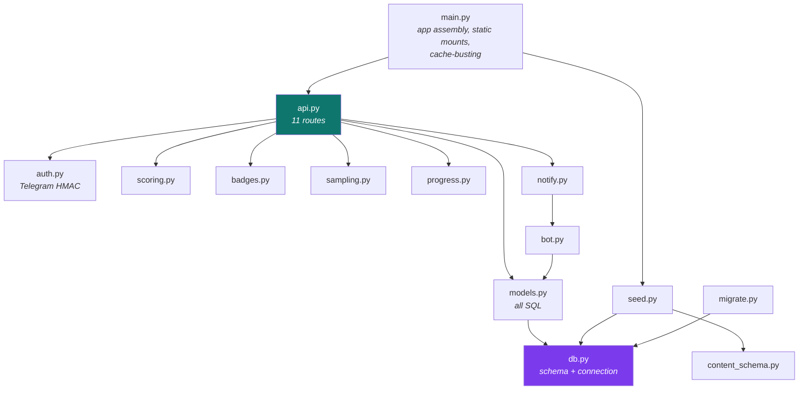
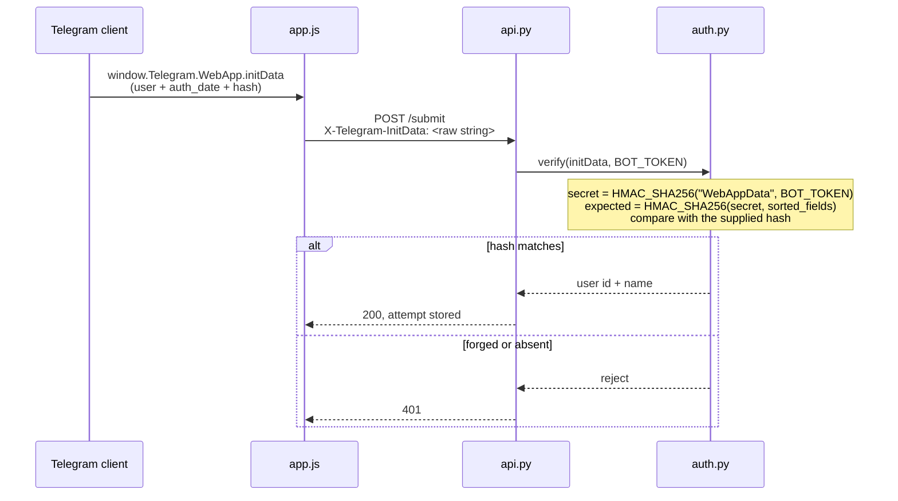
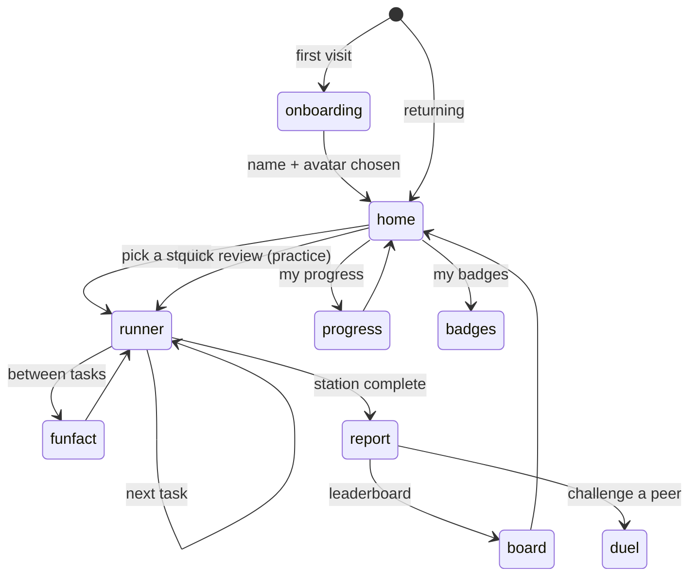
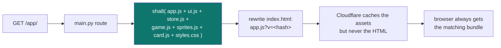
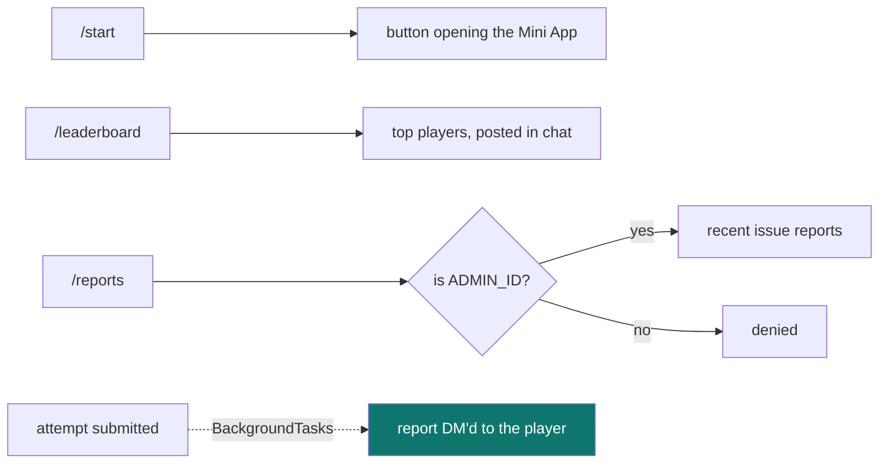

# 3 — The application

← [Local development](02-local-development.md) · [Index](README.md) · Next: [Content & scoring](04-content-and-scoring.md)

---

## Module map — who calls whom



**The rule that keeps this clean:** *all SQL lives in `models.py` and `db.py`.* Routes never write
queries inline. That's why `api.py` stays readable at 383 lines despite covering 11 endpoints.

## The data model

```mermaid
erDiagram
    quizzes ||--o{ questions : contains
    quizzes ||--o{ attempts : "played as"
    questions ||--o{ assets : "may have"
    contestants ||--o{ attempts : makes
    contestants ||--o{ badges : earns
    attempts ||--o{ answers : "records"
    questions ||--o{ answers : "answered in"
    contestants ||--o{ duels : challenges

    quizzes { int id PK, text slug UK, text title_ar, text fun_facts_json }
    questions { int id PK, int quiz_id FK, text type, text prompt_ar, int base_points, text data_json }
    contestants { int telegram_user_id PK, text first_name, text username }
    attempts { int id PK, int contestant_id FK, int quiz_id FK, int total_score, real accuracy, int max_streak }
    answers { int id PK, int attempt_id FK, int question_id FK, int retries, int hint_used, int awarded }
    badges { int id PK, int contestant_id FK, text code }
    duels { text token PK, int question_id, int creator_id, int opponent_id, text status }
    meta { text key PK, text value }
```

Ten tables. Two deserve comment:

**`questions.data_json`** holds everything type-specific — options, correct indices, match pairs,
ordering sequences, hints, explanations, **and `concept`**. It is free-form JSON parsed in Python.

> **Why isn't `concept` a column?** It would need an index and a migration every time the shape
> changed, and querying inside JSON would require SQLite's JSON1 extension — which is a build-time
> option not guaranteed on every platform. Parsing in Python costs nothing at this scale (60
> questions) and keeps the schema stable. See [D-03](10-decision-log.md#d-03-concept-inside-data_json).

**`meta`** is a two-column key/value store holding `content_sha:<slug>` — the hash of each quiz file
at the time it was last seeded. It exists solely to stop deploys from wiping leaderboards
([Ch. 8](08-data-safety.md)).

## The API surface

| Method | Route | Auth | Purpose |
|---|---|---|---|
| GET | `/api/quizzes` | — | list stations + progress |
| GET | `/api/quizzes/{slug}/questions` | — | a concept-balanced sample **with answer keys** |
| POST | `/api/quizzes/{slug}/submit` | **initData** | record an attempt, compute score, award badges |
| GET | `/api/leaderboard` | — | `scope=quiz \| overall \| season` |
| GET | `/api/me/badges` | **initData** | earned + locked badges |
| GET | `/api/me/dashboard` | **initData** | concept mastery, history, next step |
| GET | `/api/me/review` | **initData** | ~5 questions from weakest concepts |
| POST | `/api/duels` | **initData** | create a challenge, returns a deep link |
| GET | `/api/duels/{token}` | — | the challenged question + challenger's result |
| POST | `/api/duels/{token}/answer` | **initData** | settle the duel, DM both players |
| POST | `/api/report` | **initData** | in-app issue report |

## Authentication — how the app knows who you are

There is no login. Telegram signs a payload and the backend verifies it.



**Why this is sound:** the hash can only be produced by someone holding `BOT_TOKEN`, which lives
only in `.env` on the server. A learner cannot claim to be someone else. **What it does not
protect:** the *contents* of the submission — see [Ch. 4](04-content-and-scoring.md).

## The frontend

One HTML page, seven screens, swapped by toggling a class:



| File | Responsibility |
|---|---|
| `app.js` | screen switching, the task runner, every interaction type, API calls |
| `game.js` | the two-world visual lerp (Zaun → Piltover), embers, the level path |
| `sprites.js` | inline SVG icons, badge art, champion portraits |
| `card.js` | Canvas-rendered shareable certificate and lab-notebook cards |
| `store.js` | local state (name, avatar, progress cache) |
| `ui.js` | shared helpers |
| `styles.css` | the entire look, including the `--world` variable that drives the theme |

### Cache-busting, automatic



Any change to any of those files changes the hash, which changes the URL, which guarantees a cache
miss. `index.html` itself is served dynamically with `Cache-Control: no-cache`, so the fresh hash
always reaches the client.

⚠️ **Never hand-edit those `?v=` values.**

## The bot



`notify.py` sends the DM through FastAPI's `BackgroundTasks`, so the HTTP response returns
immediately and a slow Telegram call never delays the player's report screen.

---

Next: [Content & scoring](04-content-and-scoring.md) — how a JSON file becomes a scored task.
