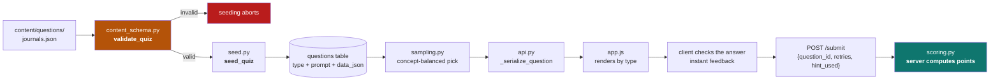
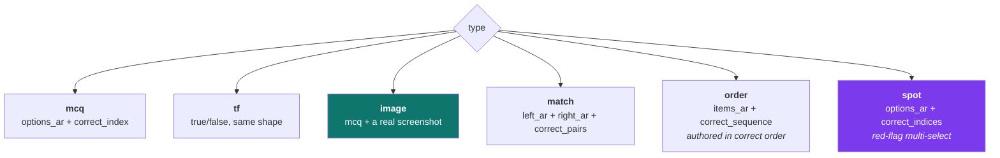
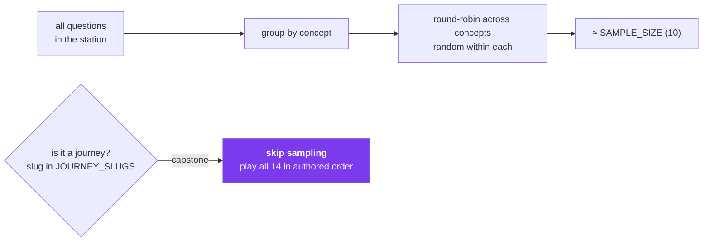
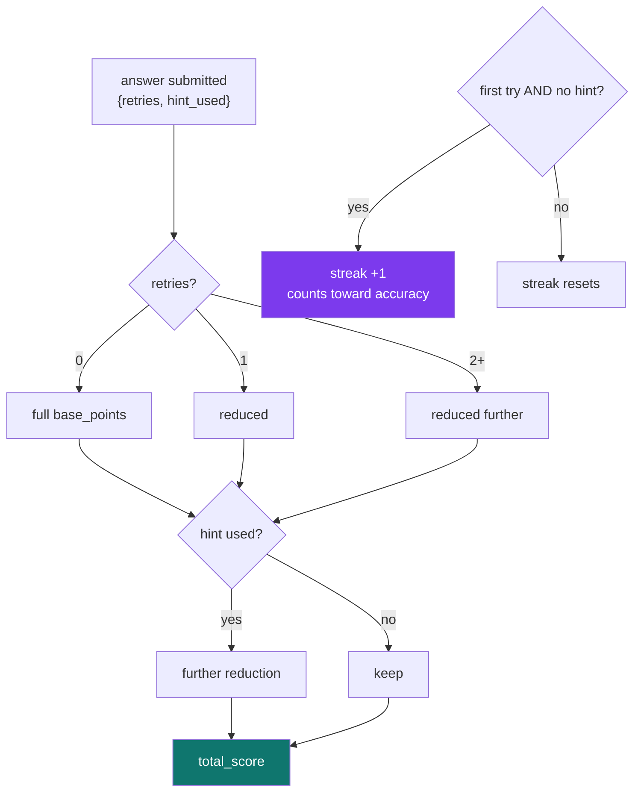
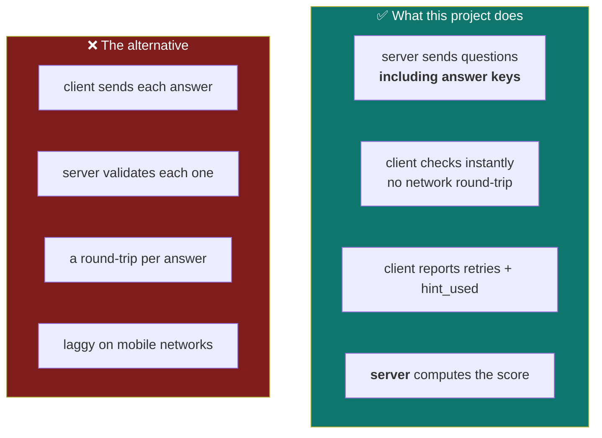
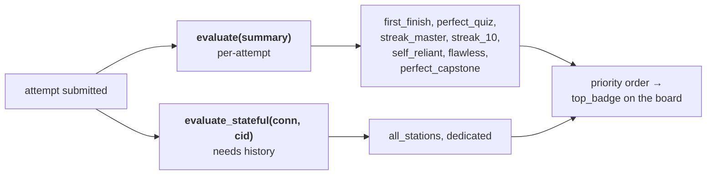

# 4 — Content & scoring

← [The application](03-the-application.md) · [Index](README.md) · Next: [GitHub workflow](05-github-workflow.md)

---

## From a JSON file to a played task



## The shape of a quiz document

```json
{
  "slug": "journals",
  "title_ar": "تصنيف المجلات العلمية",
  "pdf_filename": "…",
  "fun_facts_ar": ["…"],
  "questions": [
    {
      "type": "spot",
      "prompt_ar": "حدّد العلامات التحذيرية في رسالة الدعوة هذه",
      "concept": "predatory_journals",
      "base_points": 100,
      "options_ar": ["رسوم قبل المراجعة", "مراجعة خلال 48 ساعة", "ISSN معلن"],
      "correct_indices": [0, 1],
      "chip_explanations_ar": ["…", "…", "…"],
      "hint_ar": "…",
      "explanation_ar": "…"
    }
  ]
}
```

**`concept` is mandatory on every question.** It is what feeds the mastery dashboard and the
spaced-repetition review deck. CI fails the build if any question lacks one.

## The six task types



**`spot` is the type the application-first redesign needed.** Recall asks "what is a predatory
journal?"; `spot` shows a real solicitation email and asks *which specific lines* are the warning
signs. Checking is exact set equality — partial credit would teach that "mostly right" is right,
which is precisely the wrong lesson when evaluating a venue.

**`order` is authored already in the correct order** with `correct_sequence: [0,1,2,…]`, and the UI
shuffles for display. Authors read the sequence as prose rather than juggling indices — fewer
authoring mistakes.

## Sampling — why you don't get the same ten questions



Concept balance matters: random sampling could hand a learner five questions on one concept and
none on another, making the mastery signal meaningless.

**The capstone is exempt.** It is one coherent research project — gap → question → design →
IMRaD → venue → ethics → rebuttal. Shuffling it would destroy the narrative, so
`JOURNEY_SLUGS = {"capstone"}` makes `api.py` play it in order.

## Scoring



**Retry-until-correct with decreasing points** is a teaching choice: a learner who gets there on
the third attempt has still learned the thing. A single-shot model punishes exploration, which is
the opposite of what a *methodology* course wants.

But **streak and accuracy count only first-try, hint-free answers** — so the leaderboard still
distinguishes genuine mastery from persistence.

## The tamper-proofing trade-off



**A crafted request can claim `retries: 0` on every question.** That is a real limitation, stated
plainly in `SECURITY.md` so nobody reports it as a vulnerability.

**Why it's acceptable here:** the leaderboard is a motivational nudge among classmates, not an
assessment. Nothing is awarded on it. The cost of the alternative — a visible network round-trip
before every piece of feedback, on Syrian mobile networks, inside a Telegram webview — would damage
the teaching experience for every honest learner in order to inconvenience a dishonest one who
gains nothing.

**What is protected:** *identity*. `initData` HMAC means an attempt is always attributed to a real
Telegram account. You cannot submit as someone else.

## Badges

Ten badges, evaluated in two passes:



Two functions because some badges are decidable from one attempt and some require querying the
player's whole history. Keeping them apart means the per-attempt path stays a pure function —
easy to test, no database needed.

## Seeding, and the danger in it

⚠️ **`seed_quiz` deletes before it inserts:**

```
DELETE answers → DELETE attempts → DELETE assets → DELETE questions → DELETE quiz row → reinsert
```

Re-seeding a station therefore **erases its leaderboard**. Locally that's harmless. In production
it is guarded by per-file content hashing — a guard added *after* it destroyed real data. Read
[Ch. 11](11-incidents.md) before touching seeding.

---

Next: [The GitHub workflow](05-github-workflow.md).
