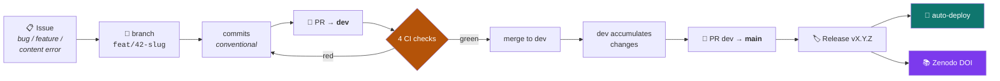
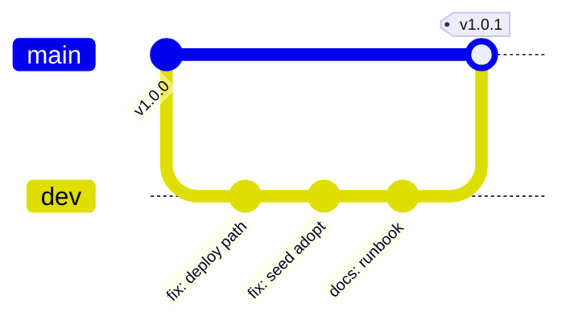
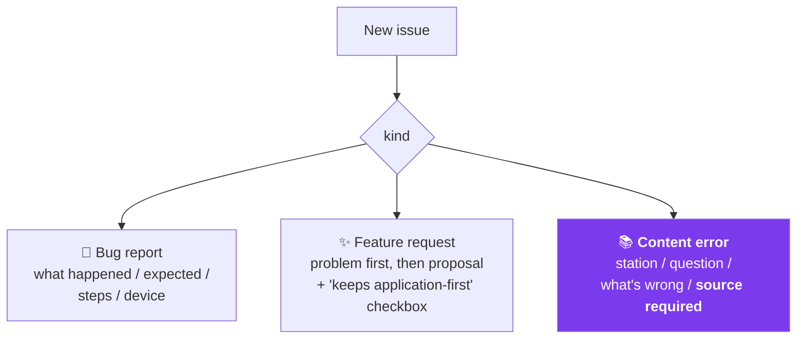
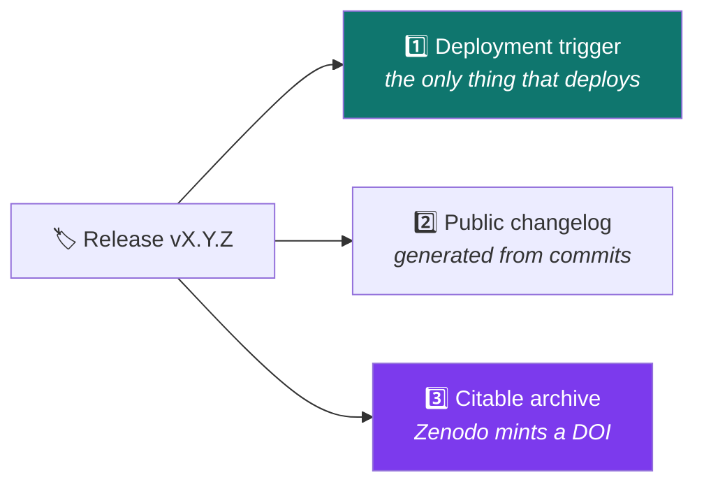
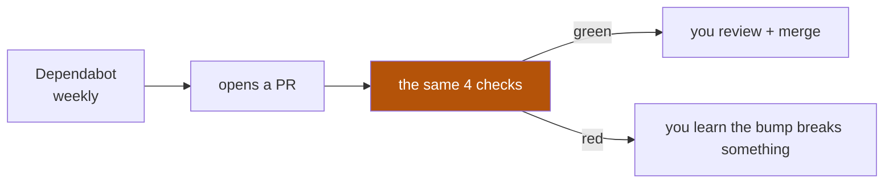

# 5 — The GitHub workflow

← [Content & scoring](04-content-and-scoring.md) · [Index](README.md) · Next: [CI/CD pipeline](06-cicd-pipeline.md)

---

## The full lifecycle of a change



## Why two long-lived branches



| Branch | Meaning | Protected |
|---|---|---|
| `main` | **what is deployed.** Every commit here is releasable | ✅ |
| `dev` | integration — work lands here first | ✅ |

**Why not just `main`?** Because `main` is wired to deployment. With a single branch, every merge
is a candidate for production and there is nowhere to let several changes settle together. `dev`
gives that space without slowing anything down.

**Both branches are protected:** no direct pushes, no force-push, no deletion, and all four CI
checks must pass. Protection applies to the repository owner too — the point is to make the *rules*
the authority, not the person.

## Conventional commits

```
feat(seed): per-quiz content hashing so deploys no longer wipe leaderboards
└─┬─┘└─┬─┘  └──────────────────────────┬────────────────────────────────┘
  │    │                               └── what changed, for a reader
  │    └── scope (optional)
  └── type: feat | fix | docs | test | refactor | chore | ci
```

Release notes are generated from these, so the subject line is written **for someone reading the
changelog**, not for the author. `fix: bug` tells a future reader nothing.

## Issue templates

Three, and the third is unusual:



**The content-error template requires a supporting source** — a citation or a standard (ICMJE,
COPE, PRISMA, STROBE, CONSORT). In a project that teaches research methodology, an unsourced
correction is exactly the habit the project exists to argue against. The template mirrors the
in-app "report an issue" button, so learners and GitHub users file the same shape of report.

## Releases do three jobs at once



That triple duty is why the release, not a push to `main`, is the deployment trigger: **the thing
that ships, the thing that is announced, and the thing that is citable are the same thing.**
A version number therefore means something concrete — you can point at `v1.0.1`, read what changed,
pull that exact image, and cite it.

## Semantic versioning here

| Bump | When |
|---|---|
| **patch** `v1.0.1` | fixes, docs, ops — no learner-visible change |
| **minor** `v1.1.0` | new content, new task type, new feature |
| **major** `v2.0.0` | breaking change to the data model or API |

⚠️ **Content changes are at least a minor bump**, because content is baked into the image and
re-seeding a changed station resets its leaderboard. A content edit is never "just a patch".

## Repository files that make it a real open-source project

| File | Why it exists |
|---|---|
| `LICENSE` | **AGPL-3.0** — copyleft that survives network use ([D-01](10-decision-log.md#d-01-agpl-30)) |
| `README.md` | front door: what, live link, architecture, dev setup, DOI badge |
| `CONTRIBUTING.md` | branch/PR conventions, test requirement, content rules |
| `SECURITY.md` | private reporting, **and the accepted trade-offs** so they aren't filed as bugs |
| `CITATION.cff` | machine-readable citation — GitHub renders a "Cite this repository" button |
| `.zenodo.json` | metadata Zenodo uses when archiving each release |
| `.github/dependabot.yml` | weekly pip / npm / actions updates |

## Dependabot in practice



This is only safe *because* CI is thorough. An automated dependency bump merged without tests is a
liability; with 141 backend and 54 frontend tests gating it, it is free maintenance.

---

Next: [The CI/CD pipeline](06-cicd-pipeline.md) — every workflow, step by step.
