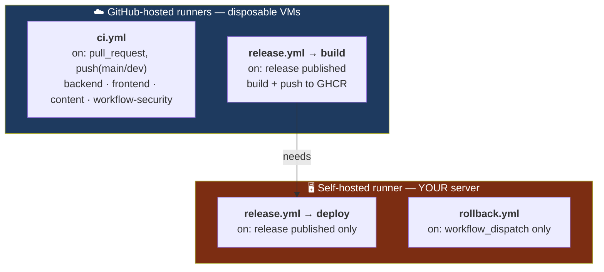
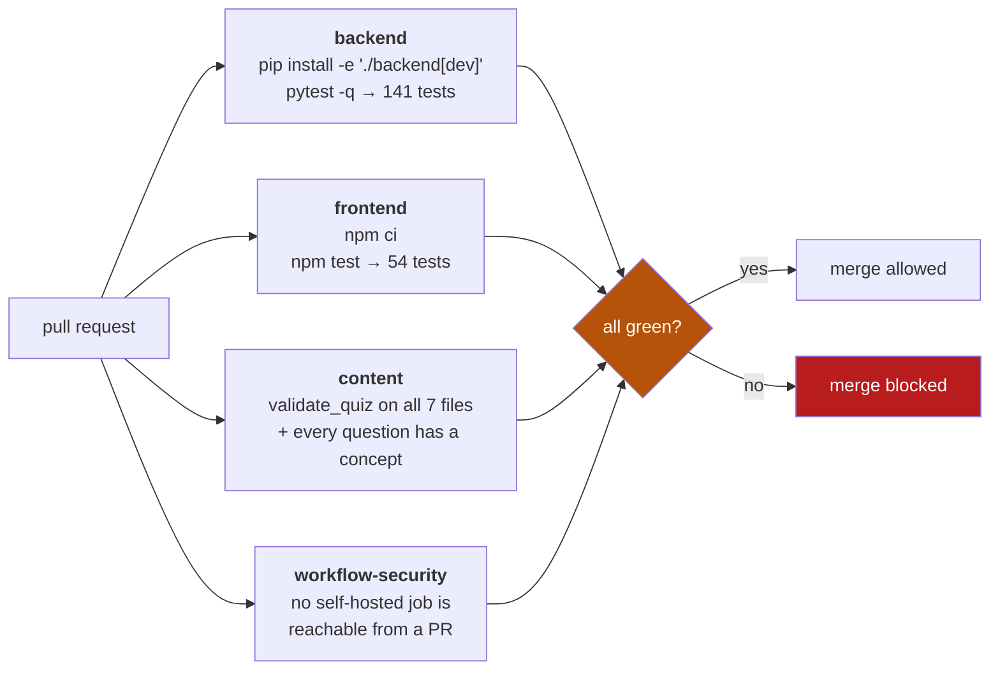
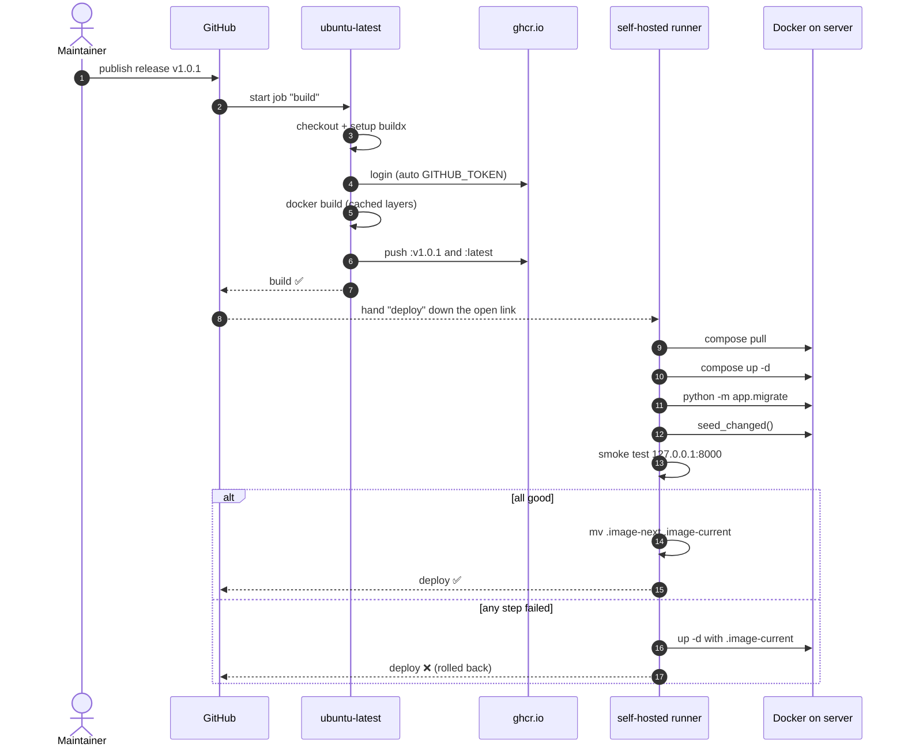
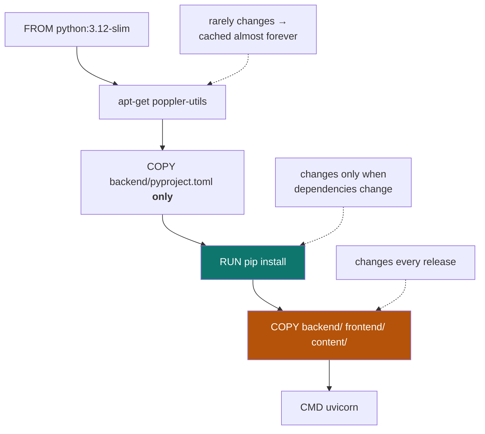
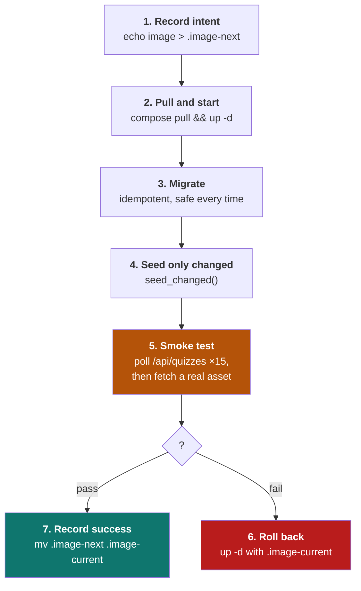
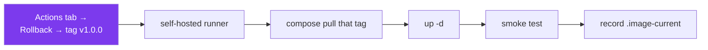

# 6 — The CI/CD pipeline

← [GitHub workflow](05-github-workflow.md) · [Index](README.md) · Next: [The server](07-the-server.md)

---

## Three workflows, two kinds of runner



**The split is the security model.** Untrusted contributor code runs *only* on GitHub's throwaway
VMs. Your server runs only fixed scripts, triggered by events only a maintainer can cause.
Full reasoning in [Ch. 9](09-security-model.md).

---

## `ci.yml` — the gate on every pull request



All four run **in parallel** on separate VMs — the slowest determines wall-clock time (~40s).

### The `workflow-security` job

This one guards the architecture itself. It parses every workflow file and fails if any job that
`runs-on: self-hosted` is reachable from `pull_request` or `pull_request_target`:

```python
selfhosted = [j for j, c in d.get("jobs", {}).items()
              if "self-hosted" in str(c.get("runs-on"))]
if selfhosted and {"pull_request", "pull_request_target"} & keys:
    bad.append((f, selfhosted))
```

**Why encode this as a test?** Because it is the single mistake that would turn a public repository
into remote code execution on a shared server. Documentation can be forgotten; a failing check
cannot.

---

## `release.yml` — build then deploy



### The build job, line by line

| Step | What it does | The subtle part |
|---|---|---|
| `actions/checkout@v4` | clone the repo onto the VM | this is the Docker *build context* |
| `docker/setup-buildx-action@v3` | start BuildKit | required for the GHA layer cache |
| `docker/login-action@v3` | sign in to `ghcr.io` | uses `secrets.GITHUB_TOKEN` — **auto-minted, job-scoped, expires with the job.** You never created it |
| `docker/build-push-action@v6` | build + push | two tags, `cache-from/to: type=gha` |

**Why `permissions: packages: write` is declared:** the automatic token is read-only by default.
Declaring the minimum needed permission is what lets it push — and nothing more.

### Why the Dockerfile is ordered the way it is



Copying `pyproject.toml` **alone** before the source is the whole trick: Docker caches layers in
order, so editing `api.py` invalidates only the last `COPY`. Dependencies are not reinstalled.
Copy the source first and every build reinstalls everything.

### The deploy job, step by step



**Why `up -d` and not `restart`:** `restart` reuses existing containers with the *old* image.
`up -d` compares desired against actual state, sees a new image tag, and recreates only what
changed — `cloudflared` is untouched, so **the tunnel never drops during a deploy.**

**Why the smoke test polls:** the container needs a second or two to bind. Fifteen attempts two
seconds apart tolerates a slow start without hanging forever.

**Why it also fetches an asset:** an API-only check would have passed during the 2026-07-28 outage,
when every image 404'd. Checking a real asset catches a broken content mount.

**Why `.image-current` matters:** it is the memory that makes rollback possible. Written only
*after* a successful smoke test, so it always names a version known to work.

⚠️ **Both files must be named explicitly:**
```yaml
COMPOSE_FILES: "-f docker-compose.prod.yml -f docker-compose.override.yml"
```
Passing an explicit `-f` **disables Compose's automatic loading** of `docker-compose.override.yml`.
Miss this and the container is recreated without the loopback port, and the smoke test can never
pass. This cost a failed deploy — see [Ch. 11](11-incidents.md).

---

## `rollback.yml` — the recovery path



Rollback is trivial **because images are immutable**. `v1.0.0` will always be the identical bytes,
however many releases follow. Recovery is a pull, not a rebuild — no dependency has drifted, no
base image has moved.

## What the pipeline costs

| Stage | Time |
|---|---|
| CI (4 parallel jobs) | ~40 s |
| Image build (cached) | ~1–2 min |
| Deploy on the server | **19 s** (measured, v1.0.1) |

---

Next: [The server](07-the-server.md).
