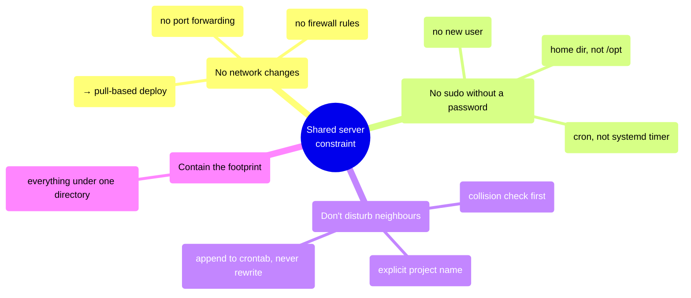
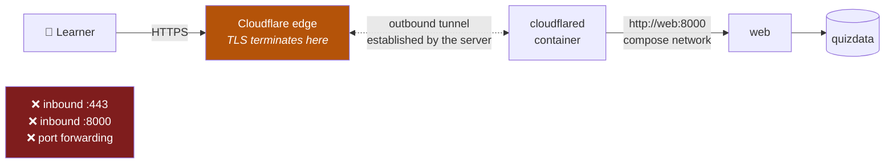
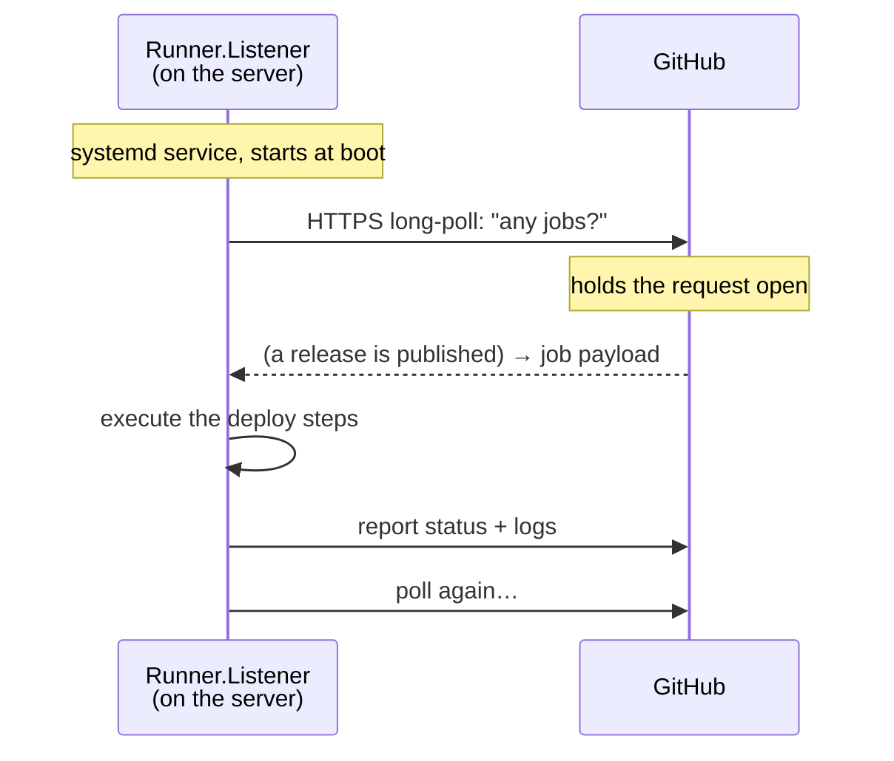
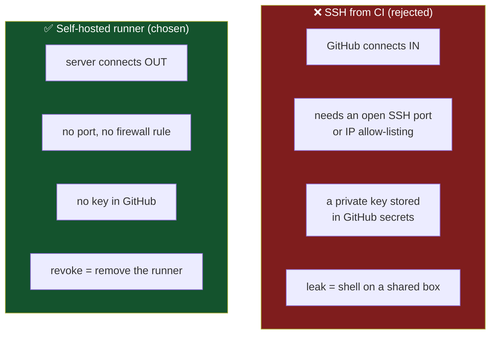
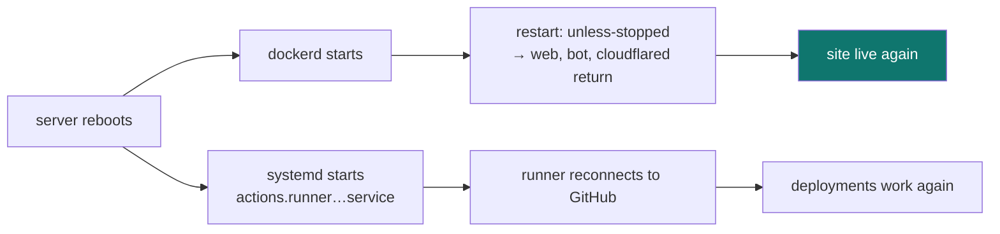

# 7 — The server

← [CI/CD pipeline](06-cicd-pipeline.md) · [Index](README.md) · Next: [Data safety](08-data-safety.md)

---

## The constraint that shaped everything

The production host is a **shared machine** running 21 unrelated containers (a Postgres, SearxNG,
about ten Squid proxies, a fleet of Android emulators). It is not ours to reconfigure.



## What actually lives there

```
/home/dev/mulham/src/
├── docker-compose.prod.yml       644  image: ghcr.io/… (no build)
├── docker-compose.override.yml   644  publishes 127.0.0.1:8000 only
├── .env                          600  secrets — never in git
├── .image-current                     the running tag (rollback memory)
├── backup.sh                     755  nightly SQLite backup
├── backups/                           quiz-YYYY-MM-DD.db ×14
└── actions-runner/               675M the GitHub runner

docker volume: researcher-journey_quizdata → /data/quiz.db
```

**No source code. No git clone. No build tools.** The deployable unit is an image; the server only
needs to know *which* image and *what secrets*.

> **Why one directory?** On a shared machine, a project that scatters files across `/opt`,
> `/etc`, and `/var` becomes impossible to audit or remove. Here, deleting one directory and one
> volume removes the entire deployment.

## How traffic arrives with no open ports



`cloudflared` **dials out** to Cloudflare and keeps the connection open. Requests arrive *down* that
existing connection. Nothing listens publicly; the router is untouched; TLS certificates are
Cloudflare's problem.

`cloudflared` reaches the app as **`http://web:8000`** — by *service name*, resolved by Docker's
internal DNS. That's why recreating `web` during a deploy is invisible: the new container gets a
new IP, and the name resolves to it automatically.

⚠️ **One tunnel token = one connector identity.** If two machines run `cloudflared` with the same
token, Cloudflare treats both as healthy and **load-balances between them** — the same URL serving
two different databases. The laptop stack must stay down while the server serves.

## How GitHub reaches a machine with nothing listening



Verified on the live machine:

```
Runner.Listener   192.168.50.62:60236  ->  20.85.130.105:443   ESTABLISHED
listening ports:  none
```

**Outbound only.** Architecturally identical to a browser holding a tab open. This is why the
approach works on a shared network where SSH-from-CI would have required policy changes.

## Why not the obvious alternative?



A third option — self-hosting Gitea/GitLab on the server with a post-receive hook — was also
rejected: it would mean running and maintaining a git server, and giving up GitHub's issues, PRs,
releases, and the Zenodo integration, in exchange for solving a problem the runner already solves.

## The two compose files

| | `docker-compose.yml` (laptop) | `docker-compose.prod.yml` (server) |
|---|---|---|
| Image | `build: .` | `image: ghcr.io/…:tag` |
| Content | **bind-mounted** — instant edits | **baked in** — ships as a version |
| Ports | `8000:8000` all interfaces | none (override adds `127.0.0.1:8000`) |
| Who runs it | you | the deploy job |

### Why the override file exists

```yaml
services:
  web:
    ports:
      - "127.0.0.1:8000:8000"
```

The deploy's smoke test must reach the API to prove the release works. Publishing `0.0.0.0:8000`
would expose the app to everything on a shared network. Binding **loopback** lets the runner — which
is on the same host — curl it, while nothing else can. Public traffic still arrives only through the
tunnel.

### Why `COMPOSE_PROJECT_NAME` is pinned

Compose names things after the directory. Here that would be `src` — producing `src-web-1` among 21
unrelated containers. `.env` sets `COMPOSE_PROJECT_NAME=researcher-journey`, so containers and the
volume are unmistakably ours, and a stray `docker compose down` in another directory cannot match
them.

## Surviving a reboot



Nobody logs in. Two independent mechanisms — Docker's restart policy and a systemd unit — bring
everything back.

> ⚠️ **The laptop had a reboot bug the server cannot have.** On the laptop, `/mnt/data` is a
> late-mounting NTFS volume; Docker started first and bind-mounted an empty directory, 404ing every
> asset. The server's files live on the root filesystem, so that race cannot occur. See
> [Ch. 11](11-incidents.md).

## Operating it by hand

```bash
cd ~/mulham/src
C="-f docker-compose.prod.yml -f docker-compose.override.yml"

docker compose $C ps
docker compose $C logs -f web
docker compose $C restart web
docker compose $C down          # ⚠️ NEVER add -v
APP_IMAGE=ghcr.io/…:v1.0.0 docker compose $C up -d    # manual rollback
```

⚠️ **`down -v` deletes the volume** — every attempt, badge, and duel. Plain `down` only removes
containers. This distinction has already saved this project once.

---

Next: [Data safety](08-data-safety.md).
