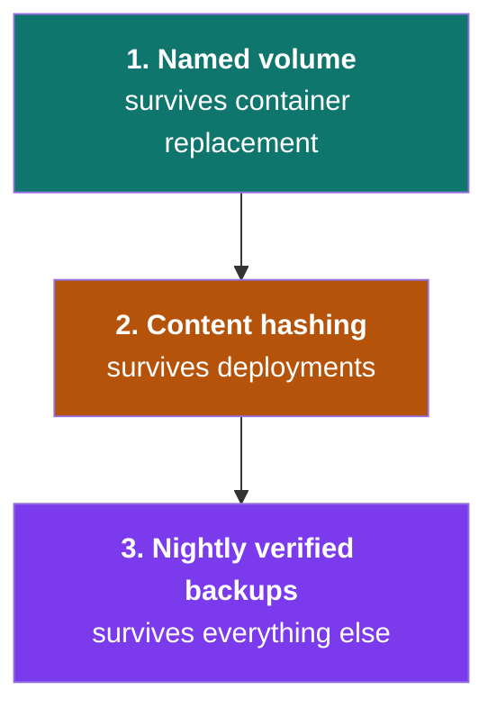
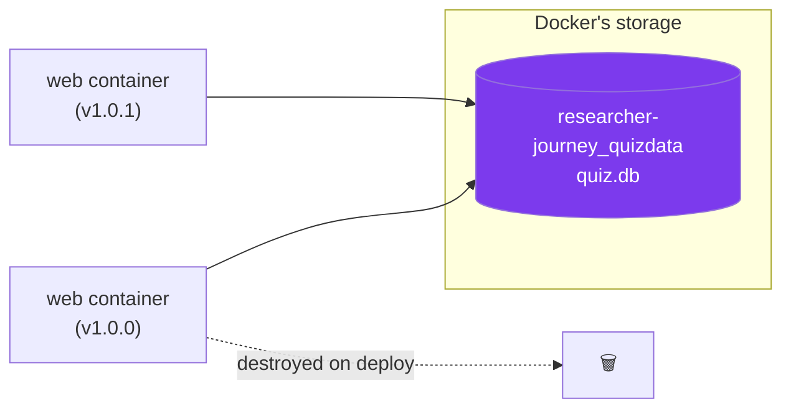
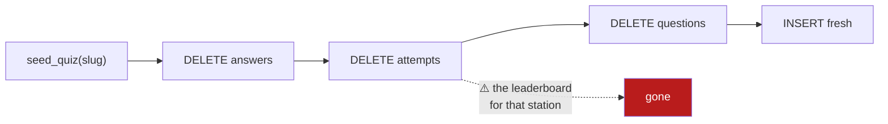
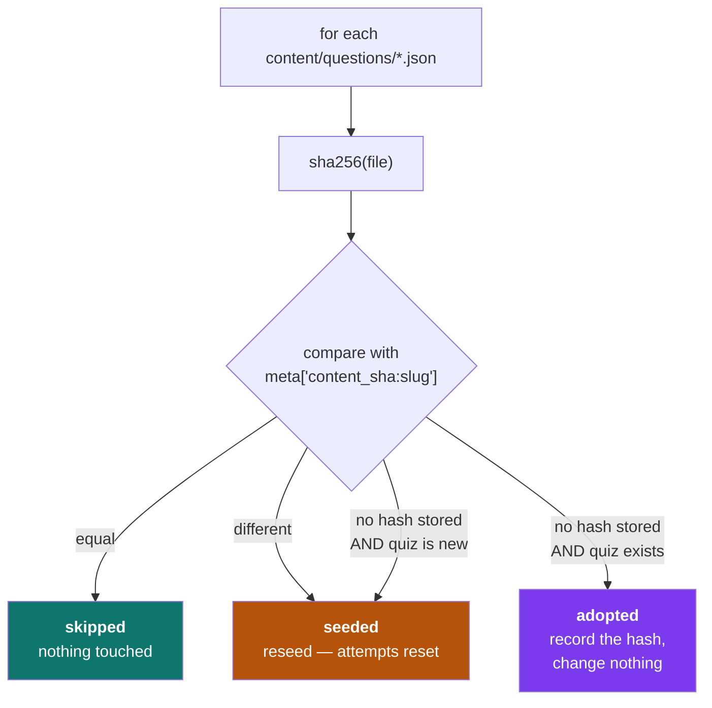
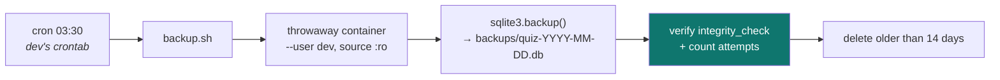
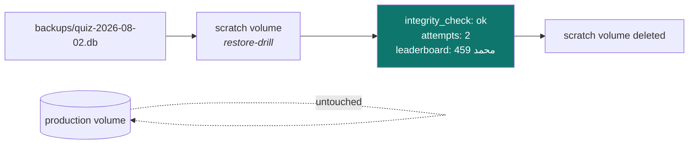
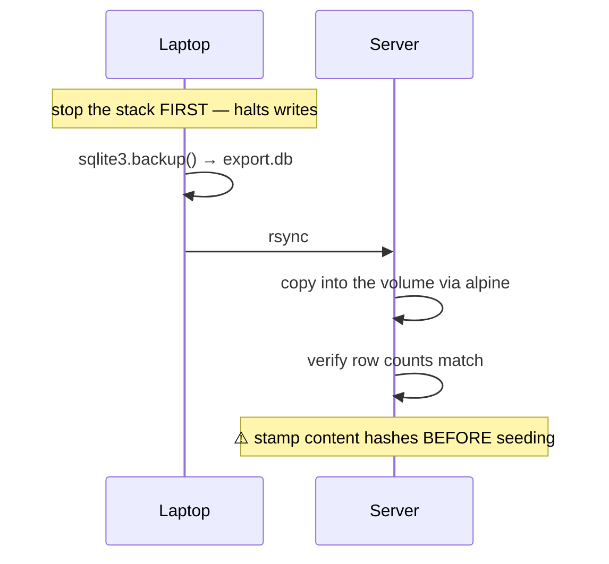

# 8 — Data safety

← [The server](07-the-server.md) · [Index](README.md) · Next: [Security model](09-security-model.md)

---

Everything a learner earns — attempts, scores, badges, duels — lives in **one SQLite file**. This
chapter is how that file survives deployments, container replacement, reboots, and mistakes.

## The three layers



---

## Layer 1 — the named volume



The volume is **independent of any container**. Deploys destroy and recreate containers; the volume
is simply re-attached.

| Operation | Data |
|---|---|
| `docker compose up -d` (new image) | ✅ survives |
| `docker compose down` then `up` | ✅ survives |
| `docker rm`, image deletion, reboot | ✅ survives |
| ⚠️ `docker compose down **-v**` | ❌ **destroyed** |
| `docker volume rm …` | ❌ destroyed |

**Why a named volume and not a bind mount?** A bind mount depends on a host path resolving
correctly at container start. On 2026-07-28 exactly that failed on the laptop — a late-mounting
disk meant Docker bound an empty directory and every asset 404'd. A named volume has no host-path
dependency and cannot fail that way.

---

## Layer 2 — content hashing (deploy safety)

### The hazard



Seeding is destructive by design — it guarantees the database matches the file. But an automated
deploy that seeds unconditionally would **wipe every leaderboard on every release**.

### The mechanism



Hashing is **per file**, so editing `journals.json` resets only the journals board; the other six
stations are untouched.

### Why "adopt" exists

This third outcome was added after a real incident. A database created *before* hashing existed has
quiz rows but no `content_sha`. Treating "no hash" as "changed" reseeded all seven stations and
**deleted every attempt** ([Ch. 11](11-incidents.md)).

The reasoning behind the fix is worth stating explicitly, because it generalises:

> **The risks are asymmetric. Data loss is irreversible; stale content is not.**
> When you cannot tell whether content changed, choose the recoverable mistake.

An adopted quiz records its hash, so any *genuine* later edit changes the hash and seeds normally.
`force=True` still reseeds deliberately.

Verified in production on v1.0.1:
```
{'seeded': [], 'skipped': ['capstone','foundations','journals',
                           'paper-parts','paper-types','publishing','submission'], 'adopted': []}
```

---

## Layer 3 — nightly backups



Every choice in that script answers a real problem:

| Choice | Why |
|---|---|
| Runs in a container | the DB is inside a Docker volume; the host has no `sqlite3` |
| `sqlite3.backup()` not `cp` | copying a live SQLite file can capture a **torn, unusable** file |
| Python's binding, not the CLI | the app image is `python:3.12-slim` — **it ships no `sqlite3` binary** |
| `--user $(id -u):$(id -g)` | otherwise backups are root-owned and `dev` can neither read nor prune them |
| source mounted `:ro` | a backup can never modify production |
| verifies after writing | **an unverified backup is not a backup** |
| reads `.image-current` | always uses the image actually deployed |
| **03:30**, not 03:00 | `dev` already has a 03:00 job — the crontab was *appended to*, never rewritten |

---

## The restore drill

Producing backups proves nothing. **Restoring one does.**



Run non-destructively, against a scratch volume, with production untouched throughout.

### Restore runbook

```bash
cd ~/mulham/src
IMAGE=$(cat .image-current)
C="-f docker-compose.prod.yml -f docker-compose.override.yml"

# 1. INSPECT first — never restore a backup you haven't opened
docker volume create restore-drill
docker run --rm -v restore-drill:/data -v ~/mulham/src/backups:/bk:ro alpine:3 \
  sh -c "cp /bk/quiz-YYYY-MM-DD.db /data/quiz.db"
docker run --rm -v restore-drill:/data "$IMAGE" python -c \
  "import sqlite3;c=sqlite3.connect('/data/quiz.db');\
print(c.execute('PRAGMA integrity_check').fetchone()[0],\
c.execute('SELECT COUNT(*) FROM attempts').fetchone()[0])"
docker volume rm restore-drill

# 2. Only once satisfied, restore for real
docker compose $C down                 # ⚠️ never -v
docker run --rm -v researcher-journey_quizdata:/data -v ~/mulham/src/backups:/bk:ro alpine:3 \
  sh -c "cp /bk/quiz-YYYY-MM-DD.db /data/quiz.db && chmod 644 /data/quiz.db"
docker compose $C up -d
```

> **Gotcha found during the real drill:** do **not** pass `--user` when copying into a *fresh*
> volume — it is root-owned until something writes to it, and the copy fails with
> `Permission denied`.

---

## Migrating a database between machines



⚠️ **That last step is the one that was missed**, and it caused the incident. A database adopted
from elsewhere arrives with **no `content_sha` rows**, so the first `seed_changed` had no baseline.
The `adopt` behaviour now handles this automatically — but when moving data by hand, stamp the
hashes first.

---

Next: [The security model](09-security-model.md).
