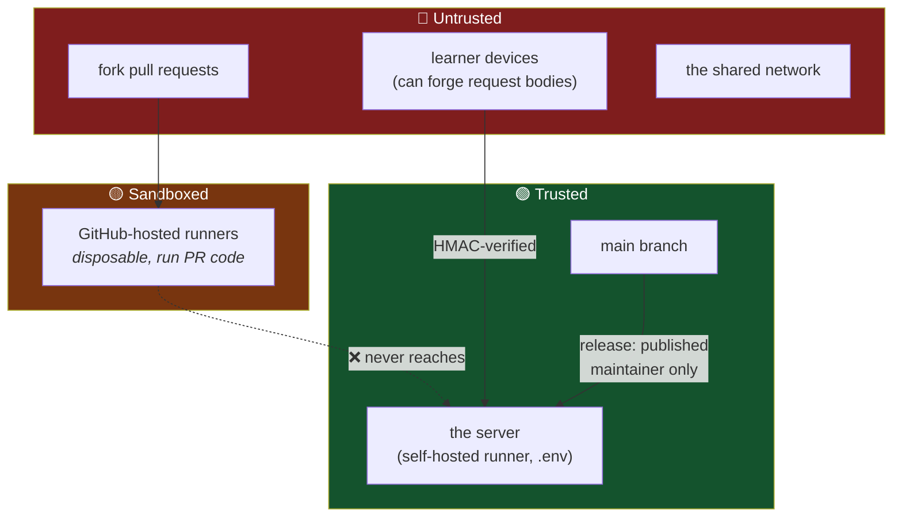
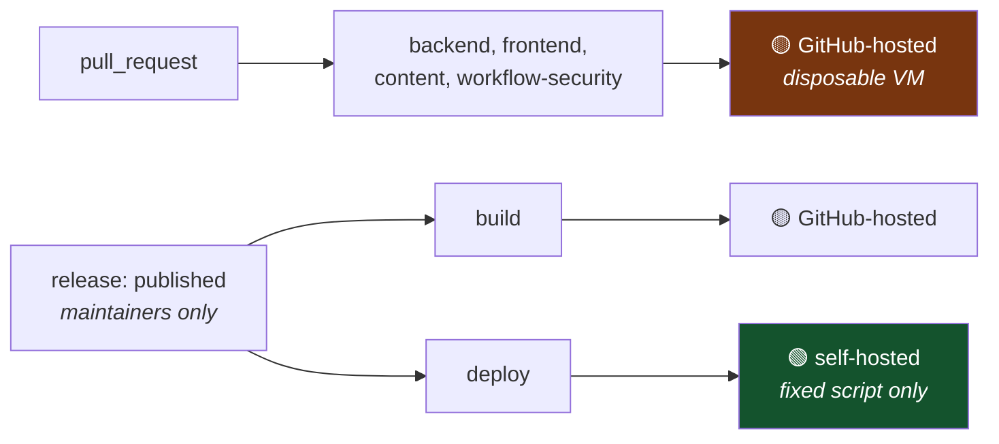
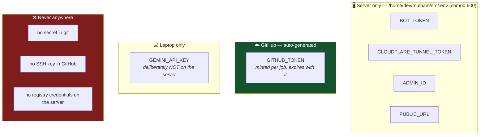
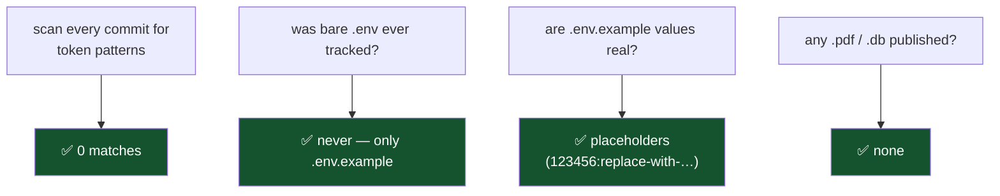
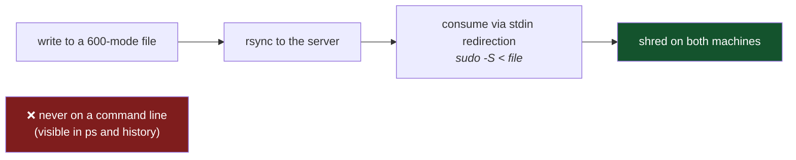

# 9 — The security model

← [Data safety](08-data-safety.md) · [Index](README.md) · Next: [Decision log](10-decision-log.md)

---

## Trust boundaries

## The central problem: a public repo with a runner on a shared server

GitHub warns against exactly this. Normally, anyone can open a pull request whose workflow runs on
your machine — remote code execution, on a box shared with other people's services.

**How it's neutralised — trust split by event, not by review:**

Three properties make this hold:

1. **No self-hosted job is reachable from `pull_request`.** A fork's code runs only on GitHub's
   throwaway VMs.
2. **`release: published` cannot be triggered by a contributor** — only someone with write access.
3. **The deploy job runs a fixed script**, not repository code. It pulls a prebuilt image and runs
   compose commands.

And crucially, this is **enforced, not documented**: the `workflow-security` CI job re-derives the
property from the workflow files on every pull request and fails if it is ever violated.

## Secrets — where each one lives

**No repository secrets were created at all.** GHCR authentication uses the automatic
`GITHUB_TOKEN`; the server needs no registry login because the package is public.

**Least privilege in practice:** the laptop's `.env` holds `GEMINI_API_KEY`/`GEMINI_PROJECT` for
local art generation. Those were **excluded** when building the server's `.env` — a shared machine
should not hold a credential it has no use for.

## Verified before publishing

Making a repository public exposes **every commit**, not just the current tree. Before pushing:

> **A methodology note:** the first scan reported a false positive because `head` exits 0 on empty
> input, so `grep … | head && echo FOUND` fires regardless. Always assert on a **count**, not on a
> pipeline's exit status.

## Handling credentials during setup

When a password or registration token was genuinely needed:

## Application-level security

| Concern | Status |
|---|---|
| **Identity** | ✅ Telegram `initData` HMAC — attempts are always attributed to a real account |
| **Admin commands** | ✅ `/reports` gated on `ADMIN_ID` |
| **SQL injection** | ✅ every query is parameterised; no string interpolation |
| **Secrets in the image** | ✅ none — `.env` is injected at runtime by `env_file` |
| **Inbound exposure** | ✅ nothing listens publicly; port 8000 is loopback-only |
| **Score integrity** | ⚠️ **accepted limitation** — see below |

### The documented limitation

Answer keys reach the client, and submissions report `retries`/`hint_used` rather than answers. A
crafted request can therefore claim a perfect run.

This is in `SECURITY.md` **so it is never reported as a vulnerability**. It is a trade-off, not an
oversight: the leaderboard carries no stakes, and the alternative would add a network round-trip
before every piece of feedback on poor mobile connections — degrading the experience for every
honest learner to inconvenience a dishonest one who gains nothing.

**Being explicit about what you are *not* protecting is part of a security model**, not an
admission of failure.

### What is genuinely in scope

Anything that lets someone read or modify **other users' data**, escape the container, reach the
host, leak environment secrets, or take over the bot: `initData` verification flaws, path traversal
in static serving, secrets in logs or images.

## Standing hygiene tasks

⚠️ Credentials that have appeared in a chat transcript should be rotated even though none were ever
in git: the **server password**, **`BOT_TOKEN`**, and the **Zenodo API token** (which is embedded in
the GitHub webhook URL and is visible to repo admins).

---

Next: [Decision log](10-decision-log.md).
