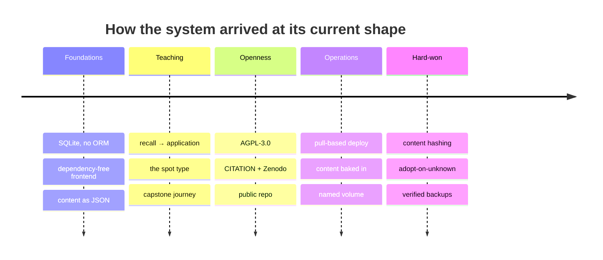

# 10 — Decision log

← [Security model](09-security-model.md) · [Index](README.md) · Next: [Incidents](11-incidents.md)

---

Every significant choice, the alternatives that were considered, and **why they lost**. A decision
without its rejected alternatives is just an assertion.

---

## D-01 — AGPL-3.0

**Chosen:** AGPL-3.0-or-later.
**Rejected:** MIT/Apache-2.0 (permissive), proprietary.

**Why:** this is an educational tool that will be *run as a network service*. Under MIT or GPL,
someone could host a modified version and never share their changes — GPL's copyleft is triggered
by *distribution*, and hosting is not distribution. AGPL closes exactly that gap: if you run a
modified version for users, they are entitled to its source.

**The cost, accepted:** AGPL deters commercial adoption and embedding. For a library that would be
a mistake; for an application meant to stay open, it is the point.

---

## D-02 — SQLite with no ORM

**Chosen:** stdlib `sqlite3`, hand-written SQL in `models.py`.
**Rejected:** SQLAlchemy; Postgres.

**Why:** ten tables, simple queries, one writer process, a few hundred users. Postgres would add a
service to run, back up, and secure. An ORM would add a dependency, a migration framework, and
indirection over SQL that is already readable.

**When this would be wrong:** concurrent writers across machines, or data outgrowing one file.
Neither applies. **Note:** this constraint is what made serverless hosting (Vercel/Firebase)
unusable — those platforms have ephemeral filesystems, so SQLite cannot persist there.

---

## D-03 — `concept` inside `data_json`

**Chosen:** store `concept` in the free-form `data_json` blob, parse in Python.
**Rejected:** a real `concept` column; querying with SQLite's JSON1.

**Why:** a column means a migration whenever the shape evolves, and JSON1 is a **compile-time
option** not guaranteed on every SQLite build — depending on it would make the app fail on some
platforms for no gain. With 60 questions, filtering in Python is free.

---

## D-04 — Client-side answer checking

**Chosen:** send answer keys to the client; it checks locally; the server scores from
`{retries, hint_used}`.
**Rejected:** validating every answer server-side.

**Why:** instant feedback. On a mobile network inside a Telegram webview, a round-trip before every
"correct/incorrect" is a visible delay repeated dozens of times per session.

**The cost, accepted and documented:** scores are not tamper-proof. The leaderboard carries no
stakes; identity is still cryptographically verified. See [Ch. 9](09-security-model.md).

---

## D-05 — Application-first content

**Chosen:** every task is *artifact + decision*.
**Rejected:** definition-recall questions.

**Why:** the stated goal is that learners "develop real research skills by applying what they have
learned, not by memorising the slides". Recall questions test whether a slide was read; application
tasks test whether a judgement can be made.

**Consequence:** far fewer questions per station (6–9 instead of ~28), which forced the seed
integrity test's floor down from 25 to 5. **Fewer, better tasks was the intent, not a regression.**

---

## D-06 — Pull-based deployment

**Chosen:** a self-hosted GitHub Actions runner that dials out.
**Rejected:** SSH-from-CI; self-hosted Gitea/GitLab with a post-receive hook.

**Why:** the server is *shared*. SSH-from-CI needs an inbound port or IP allow-listing plus a
private key in GitHub secrets — network policy changes and a credential whose leak means shell
access. A self-hosted git server means running and maintaining one, and losing GitHub's issues,
PRs, releases, and Zenodo integration.

The runner needs **no inbound access, no firewall change, and no key in GitHub.**

---

## D-07 — Bake content into the image

**Chosen:** production ships content inside the image; local development bind-mounts it.
**Rejected:** bind-mounting content in production too.

**Why:** each release becomes **one atomic, citable artifact** — code and content together, so
`v1.0.1` fully determines what a learner saw. It also eliminates the failure class that caused the
2026-07-28 outage, where a bind mount silently resolved to an empty directory.

**The cost, accepted:** a content fix now requires a release rather than a live re-seed. Slower,
but correct for a DOI-archived project.

---

## D-08 — Releases as the deployment trigger

**Chosen:** deploy on `release: published`.
**Rejected:** deploy on every push to `main`.

**Why:** it makes deployment **deliberate**, gives every deployment a version number and notes, and
makes the same event mint the Zenodo DOI. Ship, announce, and archive become one action.

It is also the security boundary: `release: published` is the only event that reaches the server,
and only a maintainer can cause it.

---

## D-09 — Named volume, never a bind mount, for the database

**Chosen:** `researcher-journey_quizdata`.
**Rejected:** a host directory bind-mounted to `/data`.

**Why:** a bind mount depends on a host path resolving correctly at container start — precisely the
failure that broke the app on 2026-07-28. A named volume is managed by Docker and has no host-path
dependency.

⚠️ **Residual risk:** `docker compose down -v` still destroys it. Mitigated by documentation in
four places and by [D-11](#d-11-verified-nightly-backups).

---

## D-10 — Per-file content hashing, and "adopt" on unknown provenance

**Chosen:** `meta['content_sha:<slug>']`; on an existing quiz with no stored hash, **adopt** —
record the hash and change nothing.
**Rejected:** always reseed; never reseed; a global (not per-file) hash.

**Why per file:** editing one station must not reset the other six.

**Why adopt:** this is the lesson from [the incident](11-incidents.md). "No hash" is ambiguous — it
means either "content changed" or "this database predates hashing". Choosing the destructive
interpretation deleted every attempt.

> **The generalisable rule: when a check cannot distinguish two cases, choose the recoverable
> mistake. Data loss is irreversible; stale content is not.**

---

## D-11 — Verified nightly backups

**Chosen:** cron at 03:30, `sqlite3.backup()`, integrity-checked after writing, 14-day retention,
plus a **restore drill**.
**Rejected:** `cp` on a schedule; no backups.

**Why the API and not `cp`:** copying a live SQLite file can capture a torn, unusable file.
**Why verify:** an unverified backup is a belief, not a backup.
**Why a restore drill:** producing backups proves nothing; restoring one proves everything.

**Why 03:30:** the machine already had a 03:00 job belonging to another project. The crontab was
appended to, never rewritten.

---

## D-12 — One directory on the shared server

**Chosen:** everything under `/home/dev/mulham/src`.
**Rejected:** `/opt/researcher-journey`; scattering across `/etc` and `/var`.

**Why:** `/opt` needs sudo, which prompts for a password here. More importantly, on a shared
machine a project scattered across the filesystem cannot be audited or cleanly removed. One
directory plus one volume **is** the deployment.

---

## D-13 — No dedicated `deploy` user

**Chosen:** run as the existing `dev`.
**Rejected:** creating a `deploy` user.

**Why:** creating a user needs sudo; `dev` already has docker access and is the only human account.
**The trade-off, stated honestly:** a dedicated user would give better isolation. On a
single-operator machine the benefit did not justify the sudo dependency.

---

## D-14 — Loopback-only port publishing

**Chosen:** `127.0.0.1:8000:8000` via an override file.
**Rejected:** publishing `0.0.0.0:8000`; no port at all.

**Why:** the deploy's smoke test must reach the API to prove a release works, and the runner is on
the same host. Loopback gives it access while nothing else on a shared network can connect. No port
at all would mean no smoke test — and an unverified deploy is a deploy you find out about from
users.

---

## D-15 — Vanilla JS, no build step

**Chosen:** plain scripts defining globals; server-side hash stamping for cache-busting.
**Rejected:** React/Vue; a bundler.

**Why:** the app runs in a Telegram webview on phones with unreliable networks. Every kilobyte is
latency. It has one page and seven screens — a framework would add weight without removing
complexity.

**Consequence:** tests load the real `index.html` and evaluate the real `app.js` in jsdom, so they
exercise shipped code rather than a transpiled copy.
