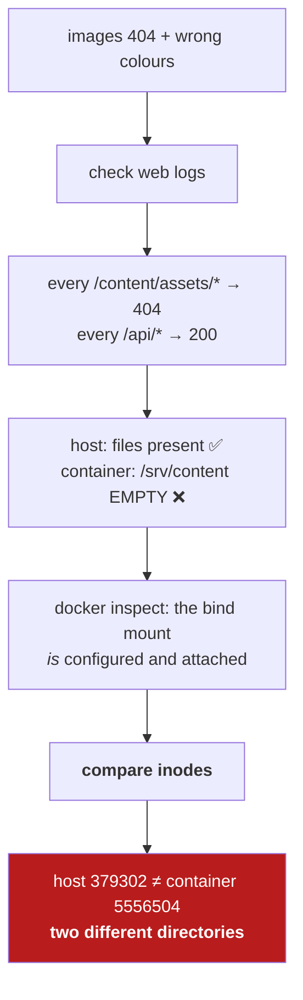
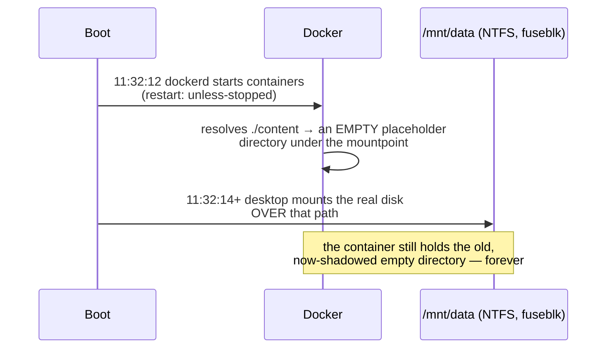
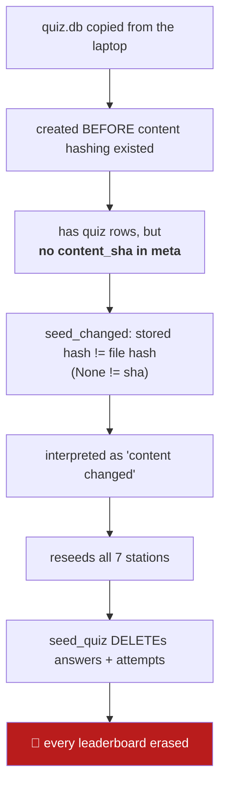
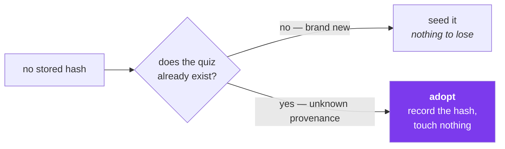
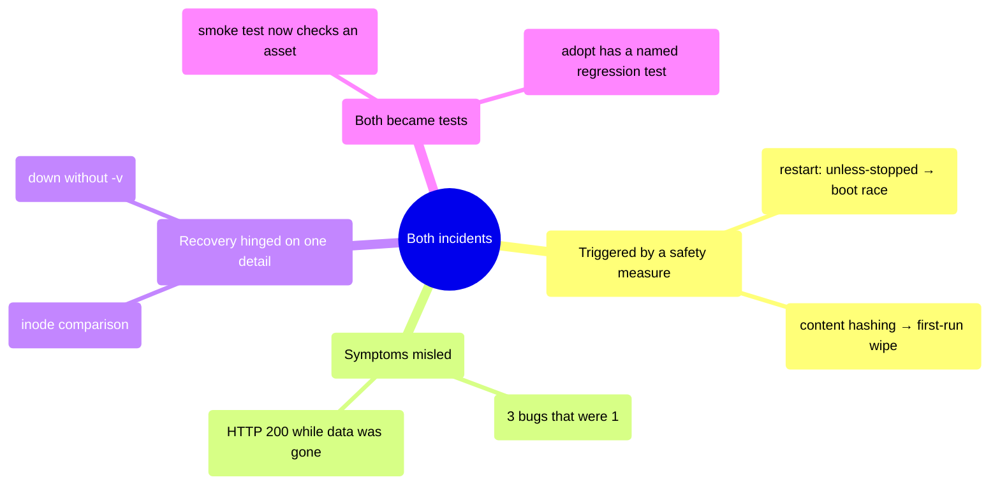

# 11 — Incidents

← [Decision log](10-decision-log.md) · [Index](README.md) · Next: [Reproduce from scratch](12-reproduce-from-scratch.md)

---

Two real failures, written up honestly. Both changed the system permanently, and both are more
instructive than any design document.

---

# Incident 1 — every asset 404s after a reboot

**Date:** 2026-07-28 · **Impact:** all images missing, text colours wrong, ~1 day of degraded UX
· **Data loss:** none

## What the user saw

> "there is a bunch of errors in the game — it was working properly yesterday — today it is full of
> bugs — images not loading — weird text colouring"

Three symptoms that sounded like three bugs. They were **one**.

## Investigation



## Root cause — a boot-order race



`/mnt/data` is **not in `/etc/fstab`** (the line is commented out); the desktop auto-mounts it later
as userspace NTFS. Docker won the race.

**The wrong colours were the same bug.** `styles.css` paints `#art-bg` with
`url(/content/assets/art/map_bg.png)`. With that 404, the painterly background vanished and the raw
Zaun gradient showed through — text lost the contrast it was designed against.

**The irony:** the `restart: unless-stopped` policy added earlier to stop the bot dying is what
created the race.

## Fix

1. `docker compose up -d --force-recreate web bot` — bind mounts re-resolve at container *create*.
2. Cloudflare had cached two 404s (`max-age=14400`), so a `?v=2` query minted fresh cache keys.
3. Permanent fix (documented, needs root): uncomment the `/mnt/data` fstab line and add
   `RequiresMountsFor=/mnt/data` to `docker.service`.

## Lessons

- **A one-line diagnostic beats an hour of theorising.** Comparing inodes settled it instantly:
  ```bash
  echo "host: $(stat -c %i content)  container: $(docker compose exec -T web stat -c %i /srv/content)"
  ```
- **"It worked yesterday" plus "nothing was deployed" points at infrastructure**, not code.
- This directly motivated [D-07](10-decision-log.md#d-07-bake-content-into-the-image) and
  [D-09](10-decision-log.md#d-09-named-volume-never-a-bind-mount-for-the-database): the production
  design makes this class of failure impossible.

---

# Incident 2 — the first production deploy deleted every attempt

**Date:** 2026-07-29 · **Impact:** all attempts and answers deleted; empty leaderboard for ~4 min
· **Data loss:** **recovered in full**

## Timeline

```mermaid
timeline
    title 2026-07-29 (UTC)
    12:17:53 : laptop stack stopped (down, no -v) : planned downtime begins
    12:18:30 : release v1.0.0 published
    12:19:39 : build SUCCEEDS : deploy job FAILS on its first step
    12:20:30 : deployed manually : site back up (~2.5 min downtime)
    12:21 : post-deploy check : attempts 2 → 0 : leaderboard EMPTY
    12:23 : restored from the laptop volume : hashes stamped : verified
```

## Cause 1 — the deploy job never ran

`release.yml` had `DIR: /opt/researcher-journey` hard-coded. The install had been moved to
`/home/dev/mulham/src` at the owner's request and the workflow was never updated. The job died at
`cd "$DIR"`.

Fixing that exposed a **second latent bug**: every compose call passed only
`-f docker-compose.prod.yml`. An explicit `-f` **disables** Compose's automatic loading of
`docker-compose.override.yml` — so the container would have been recreated *without* the
`127.0.0.1:8000` publish, and the smoke test could never have passed even after the path fix.

## Cause 2 — the data loss



**The feature written to stop deploys wiping leaderboards wiped the leaderboard**, because its very
first run had nothing to compare against.

## What saved it

The laptop stack had been stopped with `docker compose down` — **not `down -v`** — so the laptop
volume still held the original database.

> **That single character was the entire backup.**

Recovery: export from the laptop volume → rsync → load into the server volume → **stamp the content
hashes** → prove a seed run now skips → restart.

## Fix

`seed_changed` gained a third outcome, **adopt**:



Covered by `test_adopts_an_existing_quiz_that_has_no_stored_hash`, named after this incident.

**Verified in production** on v1.0.1:
```
{'seeded': [], 'skipped': [all 7], 'adopted': []}
```

## Lessons

1. **Asymmetric risk should decide ambiguous cases.** When a check cannot distinguish "changed"
   from "unknown", pick the recoverable mistake. Data loss is irreversible; stale content is not.
2. **A path used by automation must be asserted, not assumed.** A moved directory silently broke a
   pipeline that had never run.
3. **Verify data after a deploy, not just service health.** The site returned `200` the whole time
   the leaderboard was empty. A green smoke test is not proof the data survived.
4. **Any migration that adopts an existing database must bootstrap its own metadata first**, or the
   first run of a "safe" check runs with no baseline.
5. **Backups stopped being optional.** [D-11](10-decision-log.md#d-11-verified-nightly-backups) was
   implemented immediately afterwards — with a restore drill, because a backup you have never
   restored is a hope.

---

## What both incidents have in common



**The recurring theme: the mechanism added to prevent a problem became the cause of the next one.**
That is not an argument against safety measures — it is an argument for testing them against
*existing* state, not just the clean case.

---

Next: [Reproduce from scratch](12-reproduce-from-scratch.md).
