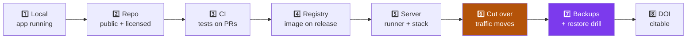
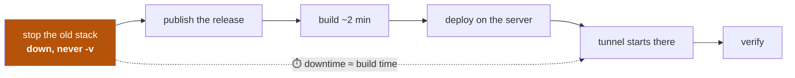
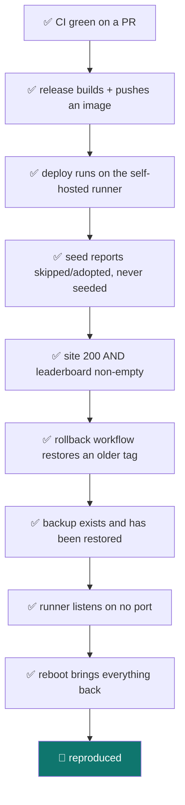

# 12 — Reproduce from scratch

← [Incidents](11-incidents.md) · [Index](README.md)

---

Build the entire system — empty directory to live, auto-deploying, citable — from nothing.
Each phase says **what** you do, **why**, and **how to verify it worked**.



⏱️ Roughly 3–4 hours, most of it waiting.

---

## Phase 1 — Local

```bash
git clone <repo> && cd <repo>
pip install -e './backend[dev]'
cd frontend && npm install && cd ..
./scripts/test.sh
cd backend && QUIZ_DB_PATH=../quiz.db uvicorn app.main:app --reload --port 8000
```

✅ **Verify:** `http://localhost:8000/app/` loads and a station is playable.
A **401 on submit is expected** — no Telegram `initData` outside Telegram.

---

## Phase 2 — The repository

**Before pushing anything public, audit the whole history.** A public repo exposes every commit.

```bash
# was a bare .env EVER tracked?
git rev-list --all | xargs -I{} git ls-tree -r --name-only {} | sort -u | grep -x '.env' \
  && echo "STOP" || echo "clean"

# token-shaped strings anywhere in history — assert on the COUNT, not on a pipeline's exit code
n=$(git grep -I -E "[0-9]{8,10}:AA[A-Za-z0-9_-]{33}" $(git rev-list --all) 2>/dev/null | wc -l)
echo "matches: $n"   # must be 0
```

> ⚠️ `grep … | head && echo FOUND` gives a **false positive** — `head` exits 0 on empty input.
> Always compare a count.

Add the scaffolding, then publish:

```bash
curl -fsSL https://www.gnu.org/licenses/agpl-3.0.txt -o LICENSE
# + README, CONTRIBUTING, SECURITY, CITATION.cff, .zenodo.json,
#   .github/ISSUE_TEMPLATE/*, pull_request_template.md, dependabot.yml

git branch -m master main && git branch dev
gh repo create <name> --public --source=. --remote=origin --push
git push -u origin dev
```

Protect both branches and create the deployment environment:

```bash
for BR in main dev; do
  gh api -X PUT repos/:owner/:repo/branches/$BR/protection \
    -H "Accept: application/vnd.github+json" --input protection.json
done
gh api -X PUT repos/:owner/:repo/environments/production
```

✅ **Verify:** `gh api repos/:owner/:repo --jq '.license.spdx_id'` → `AGPL-3.0`; both branches show
`protected: true`; no `.env`/`.pdf`/`.db` in the published tree.

---

## Phase 3 — CI

Create `.github/workflows/ci.yml` with four jobs, **all on `ubuntu-latest`**: `backend`,
`frontend`, `content`, `workflow-security`.

The last one is the guard that keeps the whole security model true:

```yaml
- name: No self-hosted job may be reachable from a pull request
  run: |
    python3 - <<'PY'
    import glob, sys, yaml
    bad = []
    for f in sorted(glob.glob(".github/workflows/*.yml")):
        d = yaml.safe_load(open(f))
        trig = d.get(True) or d.get("on")      # bare `on:` parses as True
        keys = set(trig) if isinstance(trig, dict) else {trig} if isinstance(trig, str) else set(trig or [])
        sh = [j for j, c in d.get("jobs", {}).items() if "self-hosted" in str(c.get("runs-on"))]
        if sh and {"pull_request", "pull_request_target"} & keys:
            bad.append((f, sh))
    sys.exit(1 if bad else 0)
    PY
```

✅ **Verify:** open a throwaway PR; all four checks pass.

---

## Phase 4 — Image on release

`release.yml` → job `build` on `ubuntu-latest`: checkout → buildx → login to `ghcr.io` with
`secrets.GITHUB_TOKEN` → `docker/build-push-action` with tags `:vX.Y.Z` and `:latest`,
`cache-from/to: type=gha`.

Declare `permissions: packages: write` — the automatic token is read-only otherwise.

✅ **Verify (anonymously, which also proves the package is public):**
```bash
REPO=<owner>/<repo>
TOK=$(curl -s "https://ghcr.io/token?scope=repository:$REPO:pull&service=ghcr.io" \
      | python3 -c "import json,sys;print(json.load(sys.stdin)['token'])")
curl -s -H "Authorization: Bearer $TOK" "https://ghcr.io/v2/$REPO/tags/list"
```

---

## Phase 5 — The server

**Survey before you touch anything** — especially on a shared machine:

```bash
docker ps --format '{{.Names}} {{.Ports}}'         # what already runs
ss -ltn | grep -c ':8000 '                         # is your port free?
docker volume ls | grep -i quiz                    # name collisions?
crontab -l                                         # existing jobs (do NOT clobber)
sudo -n true && echo "passwordless" || echo "sudo prompts"
```

Then create the layout:

```bash
mkdir -p ~/mulham/src && cd ~/mulham/src
# rsync docker-compose.prod.yml from the repo
cat > docker-compose.override.yml <<'YAML'
services:
  web:
    ports: ["127.0.0.1:8000:8000"]     # loopback only
YAML
cat > .env <<'ENV'
COMPOSE_PROJECT_NAME=researcher-journey
QUIZ_DB_PATH=/data/quiz.db
BOT_TOKEN=…
CLOUDFLARE_TUNNEL_TOKEN=…
ADMIN_ID=…
PUBLIC_URL=https://…
ENV
chmod 600 .env
```

> Copy **only** the secrets the server needs. Local-only credentials (e.g. an image-generation API
> key) must not land on a shared machine.

### Load an existing database — and stamp its hashes

⚠️ **This is the step whose omission caused [Incident 2](11-incidents.md).**

```bash
# on the source machine, with the stack STOPPED so writes have halted
docker run --rm -v <old_volume>:/data -v "$PWD":/out python:3.12-slim python -c \
 "import sqlite3;s=sqlite3.connect('/data/quiz.db');d=sqlite3.connect('/out/export.db');s.backup(d);d.close()"
rsync export.db server:~/mulham/src/

# on the server
docker volume create researcher-journey_quizdata
docker run --rm -v researcher-journey_quizdata:/data -v ~/mulham/src:/src alpine:3 \
  sh -c "cp /src/export.db /data/quiz.db && chmod 644 /data/quiz.db"

# ⚠️ STAMP THE HASHES before anything seeds
docker run --rm -v researcher-journey_quizdata:/data -e QUIZ_DB_PATH=/data/quiz.db \
  -w /srv/backend "$IMAGE" python -c "
import sys, glob, json; sys.path.insert(0,'.')
from app.db import connect, init_schema
from app.migrate import migrate
from app.seed import file_sha256, _set_meta
c = connect('/data/quiz.db'); init_schema(c); migrate(c)
for p in sorted(glob.glob('/srv/content/questions/*.json')):
    _set_meta(c, 'content_sha:'+json.load(open(p,encoding='utf-8'))['slug'], file_sha256(p))
c.commit(); print('stamped')"
```

✅ **Verify:** row counts match the source **and** a `seed_changed` run reports `seeded: []`.

### Install the runner

```bash
mkdir -p ~/mulham/src/actions-runner && cd $_
curl -fsSL -o r.tar.gz https://github.com/actions/runner/releases/download/v<VER>/actions-runner-linux-x64-<VER>.tar.gz
tar xzf r.tar.gz && rm r.tar.gz
./config.sh --url https://github.com/<owner>/<repo> --token <REGISTRATION_TOKEN> \
            --name <host> --labels self-hosted,linux,x64 --work _work --unattended --replace
sudo ./svc.sh install $USER && sudo ./svc.sh start
```

Generate the token with `gh api -X POST repos/:owner/:repo/actions/runners/registration-token`.
It expires in ~1 hour. **Pass secrets via a `600` file and stdin, never on a command line**, and
shred them afterwards.

✅ **Verify:**
```bash
gh api repos/:owner/:repo/actions/runners --jq '.runners[].status'   # online
ss -ltnp | grep -i runner || echo "listens on NO port ✓"             # outbound only
```

---

## Phase 6 — Cut traffic over

⚠️ **The riskiest step.** Two `cloudflared` connectors sharing one token make Cloudflare
load-balance between them — the same URL serving two diverging databases.



✅ **Verify — and check the data, not only the HTTP code:**
```bash
curl -s -o /dev/null -w '%{http_code}\n' https://<domain>/api/quizzes     # 200
curl -s "https://<domain>/api/leaderboard?scope=overall" | head -c 200    # NOT []
```

> The site returned `200` throughout Incident 2 while the leaderboard was empty. **A green health
> check is not proof the data survived.**

---

## Phase 7 — Backups, and prove them

Install `backup.sh` (container + `sqlite3.backup()` + `--user` + read-only source + integrity check
+ 14-day prune), then **append** to crontab at a time no existing job uses:

```bash
TMP=$(mktemp); crontab -l > "$TMP" 2>/dev/null || true
echo '30 3 * * * /home/dev/mulham/src/backup.sh >> /home/dev/mulham/src/backups/backup.log 2>&1' >> "$TMP"
crontab "$TMP"; rm "$TMP"
crontab -l          # ⚠️ confirm pre-existing jobs are still there
```

**Then restore one.** Non-destructively, into a scratch volume:

```bash
docker volume create restore-drill
docker run --rm -v restore-drill:/data -v ~/mulham/src/backups:/bk:ro alpine:3 \
  sh -c "cp /bk/quiz-YYYY-MM-DD.db /data/quiz.db"      # no --user on a fresh volume
docker run --rm -v restore-drill:/data "$IMAGE" python -c \
  "import sqlite3;c=sqlite3.connect('/data/quiz.db');print(c.execute('PRAGMA integrity_check').fetchone()[0], c.execute('SELECT COUNT(*) FROM attempts').fetchone()[0])"
docker volume rm restore-drill
```

✅ **Verify:** `integrity ok` and a non-zero attempt count. **A backup you have never restored is a
hope, not a backup.**

---

## Phase 8 — The DOI

Enable the Zenodo↔GitHub toggle **before** the release you want archived — Zenodo only captures
releases created after the switch is on. Then publish, and add the badge to `README.md`.

⚠️ The webhook URL Zenodo installs **contains an API token in plaintext**. Treat it as a secret;
rotate it if it is ever displayed.

---

## Final acceptance checklist



---

## The five things worth stealing for another project

1. **Compare inodes** when a mount looks right but behaves wrong.
2. **Assert on counts**, never on a pipeline's exit status, when scanning for secrets.
3. **When a check cannot distinguish two cases, choose the recoverable mistake.**
4. **Verify data after a deploy, not just service health.**
5. **A self-hosted runner turns "GitHub must reach my server" into "my server reaches GitHub"** —
   which is the difference between changing network policy and changing nothing.
