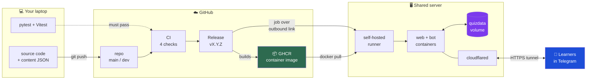
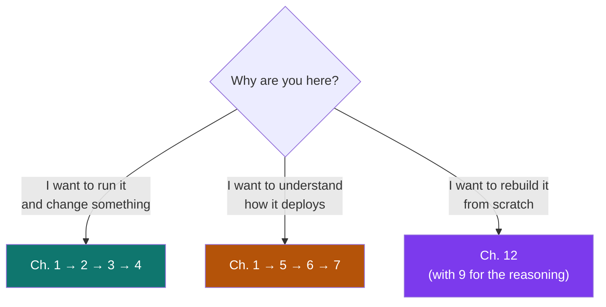

# The Researcher's Journey — System Handbook

A complete, visual explanation of this system: how it is built, how it is developed, how it
reaches a server, and **why every significant decision was made that way**.

Written so that someone who has never seen the project can read it end to end and rebuild the
whole thing from an empty directory.

---

## The system in one picture

**One sentence:** you push code, GitHub tests it, publishing a release builds a container image, and
your server pulls that exact image and serves it through a Cloudflare tunnel — with no inbound port
open anywhere.

---

## How to read this handbook

Three paths depending on why you're here.

---

## Chapters

| # | Chapter | What it answers |
|---|---------|-----------------|
| 1 | [The big picture](01-big-picture.md) | What the pieces are and how a request flows through them |
| 2 | [Local development](02-local-development.md) | Clone → run → test → change something safely |
| 3 | [The application](03-the-application.md) | Backend, frontend, and bot internals |
| 4 | [Content & scoring](04-content-and-scoring.md) | How a JSON file becomes a playable, scored task |
| 5 | [The GitHub workflow](05-github-workflow.md) | Issues, branches, PRs, releases, protection |
| 6 | [The CI/CD pipeline](06-cicd-pipeline.md) | Every workflow, step by step |
| 7 | [The server](07-the-server.md) | What lives there and how it serves traffic |
| 8 | [Data safety](08-data-safety.md) | Volumes, backups, restore drills |
| 9 | [The security model](09-security-model.md) | Trust boundaries and why they hold |
| 10 | [Decision log](10-decision-log.md) | Every significant choice, with alternatives rejected |
| 11 | [Incidents](11-incidents.md) | What broke, why, and what changed as a result |
| 12 | [Reproduce from scratch](12-reproduce-from-scratch.md) | The complete build, empty directory → live |

---

## Conventions used here

- **Every diagram is Mermaid**, rendered by GitHub — no image files to go stale.
- Commands are shown exactly as run, with the directory they run in.
- Where a decision had a real alternative, the alternative is stated **and why it lost**.
- ⚠️ marks something that has actually caused an outage in this project.

## The five facts worth knowing before anything else

1. **The database is a single SQLite file** on a Docker named volume. No ORM, no server.
2. **Scoring is retry- and hint-aware**, computed server-side, but answer keys reach the client —
   a deliberate trade-off, explained in [Ch. 4](04-content-and-scoring.md).
3. **Content lives in JSON**, is baked into the release image, and ships as a version.
4. **The server holds no source code** — only a compose file, a `.env`, and a volume.
5. ⚠️ **`docker compose down -v` destroys everything.** The `-v` deletes the volume. Plain `down`
   is safe. That one character is why a real data-loss incident was recoverable
   ([Ch. 11](11-incidents.md)).
